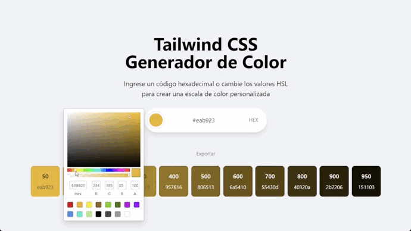

# Generador de Paletas de Color

Crea paletas de colores y exportalas para Tailwind (Hex). Creada con Electron y React.



Para iniciar este proyecto usé [esta documentación.](https://electron-vite.org/guide/#scaffolding-your-first-electron-vite-project)


## Configuración

### Instalación

```bash
$ npm install -f
```

### Desarrollo

```bash
$ npm run dev
```

### Compilación

```bash
# Para windows
$ npm run build:win

# Para macOS
$ npm run build:mac

# Para Linux
$ npm run build:linux
```
